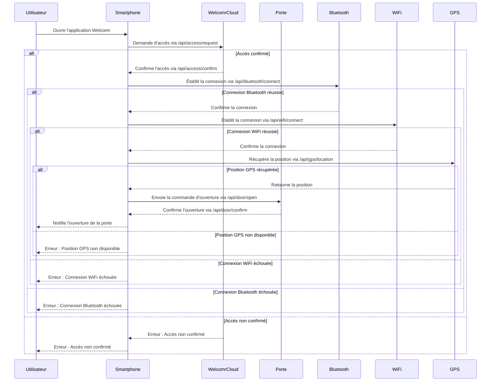

# IoT
## Liste des objets connectés autours de vous
- Porte de la fab 
- montre 
- portable 
- aspirateur robot 
- lave linge 
- sèche linge 
- ordinateur / tablette 
- chauffage / thermostat 
- store 
- cigarette électronique 
- voiture 
- moto 
- gourde 
- vélo 
- console jeux 
- bague 
- balance 
- chaussure / semelle 
- lunette 
- vêtements 
- fourchette 

## Mermaid WelcomerDoor

## Code NodeRed

